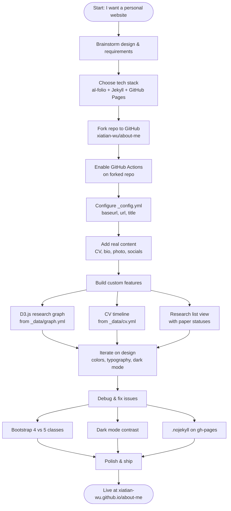

This site was built over the course of a single focused session using [Claude Code](https://claude.com/claude-code) as an AI coding assistant. What started as "I want a personal academic website" turned into a full product cycle: choosing a tech stack, forking a theme, customizing content and design, debugging deployment failures, and iterating on UI feedback. This post documents the key decisions, the workflow we followed, and the lessons I took away.

---

## The Workflow at a Glance

---

## Key Decisions

### 1. Tech Stack: al-folio + GitHub Pages

I chose [al-folio](https://github.com/alshedivat/al-folio), a Jekyll theme built specifically for academics. It provided a solid starting point with publication support, dark mode, and a clean layout. Deployment is handled entirely through **GitHub Actions** — no local Ruby environment needed.

**Why this mattered:** Skipping a local build toolchain meant I could focus on content and customization rather than environment setup. The tradeoff is a slower feedback loop (each change requires a push and ~2 minute build), but for a content-heavy site this was the right call.

### 2. Separate Data File for the Research Graph

Jekyll's `jekyll-scholar` plugin parses BibTeX for the publications page, but Liquid templates cannot iterate over BibTeX data directly. Rather than fight the framework, I created `_data/graph.yml` as a parallel data source that drives the D3.js force-directed graph.

This means paper metadata lives in two places (`_bibliography/papers.bib` and `_data/graph.yml`), but it keeps the graph logic simple and testable.

### 3. D3.js for the Research Visualization

The research page features an interactive force-directed graph linking me to my research topics and publications. Key design choices:

- **Project nodes** click to switch view and scroll to the list section (no page navigation)
- **Paper nodes** with a published DOI open the paper directly
- **Hover tooltips** show the research topic description
- Node colors encode paper status: green (published), yellow (under review), grey (in preparation)

### 4. Color Scheme

The default al-folio theme uses a magenta-purple (`#b509ac`). We replaced it with a modern indigo palette:

| Context | Color |
|---|---|
| Light mode accent | `#4f46e5` (indigo) |
| Dark mode accent | `#818cf8` (soft indigo) |
| Page background (light) | `#f5f7fa` (off-white) |
| Page background (dark) | `#16181d` |

The off-white background replaces pure white, adding visual depth without changing any content.

### 5. CV Timeline via YAML

Rather than hand-coding HTML for the experience and education sections, I used al-folio's RenderCV format in `_data/cv.yml`. The layout renders it automatically on the About page. This keeps my CV data structured and easy to update.

---

## Lessons Learned

### Always check Bootstrap version
al-folio uses Bootstrap **4**, not 5. This caused several bugs where I used Bootstrap 5 class names:

| Bootstrap 5 (wrong) | Bootstrap 4 (correct) |
|---|---|
| `ms-2`, `me-2` | `ml-2`, `mr-2` |
| `badge bg-warning text-dark` | `badge badge-warning` |
| `gap-2` (flex) | custom CSS |

### GitHub Actions must be manually enabled on forks
When you fork a public repo, GitHub disables Actions by default. The site will not deploy until you go to **Settings → Actions → Allow all actions** in your forked repo.

### Add `.nojekyll` to the `gh-pages` branch
GitHub Pages auto-runs Jekyll on any branch it serves. If you are deploying a pre-built Jekyll site (which GitHub Actions already built), GitHub will try to build it *again* and fail on the custom plugins. The fix is a `.nojekyll` file in the root of the `gh-pages` branch.

### Dark mode requires explicit overrides for Bootstrap components
Bootstrap hardcodes `background-color: #fff` on `.list-group-item`. In dark mode, this creates invisible light-grey-on-white text. The fix: wrap the CV section in a `.cv` class so al-folio's theme-aware styles apply, and add explicit dark mode overrides.

### CSS variables work in SVG via `.style()`, not `.attr()`
In D3.js, setting `.attr('fill', 'var(--global-text-color)')` does not work — the browser does not resolve CSS variables in SVG attributes. Use `.style('fill', 'var(--global-text-color)')` instead. This is how the graph node labels adapt to light and dark mode automatically.

### Commit and push — edits don't auto-deploy
Changes to local files do nothing until committed and pushed to `main`. Early in the session I edited several files and could not understand why the live site was not updating. The answer: I had not committed yet.

---

## What I Would Do Differently

1. **Write a design spec first.** We did eventually create a spec (`docs/superpowers/specs/`), but doing it upfront would have avoided some back-and-forth on the research graph interaction model.

2. **Test dark mode from the start.** Most design reviews were done in light mode. Dark mode issues (contrast, Bootstrap overrides) were discovered late and required a second pass.

3. **Keep BibTeX and graph.yml in sync from day one.** Adding papers to one file and forgetting the other led to missing entries in the graph.

---

## Recommended Skills for Future Projects Like This

If you use **Claude Code** with the [Superpowers plugin](https://github.com/superpowers), these skills are particularly valuable for static site projects:

| Skill | When to use |
|---|---|
| `superpowers:writing-plans` | Before starting any feature — write a spec and break it into tasks |
| `superpowers:subagent-driven-development` | Execute a plan task-by-task with automated review between each step |
| `superpowers:finishing-a-development-branch` | Clean wrap-up: tests, PR creation, or local merge |
| `superpowers:requesting-code-review` | Get a second-opinion review after completing a feature |

The most impactful habit is **writing a plan before coding**. Even a short bulleted list of steps prevents the drift that comes from making decisions on the fly — and gives the AI assistant a shared contract to work against.

---

*Built with [al-folio](https://github.com/alshedivat/al-folio) and [Claude Code](https://claude.com/claude-code).*
